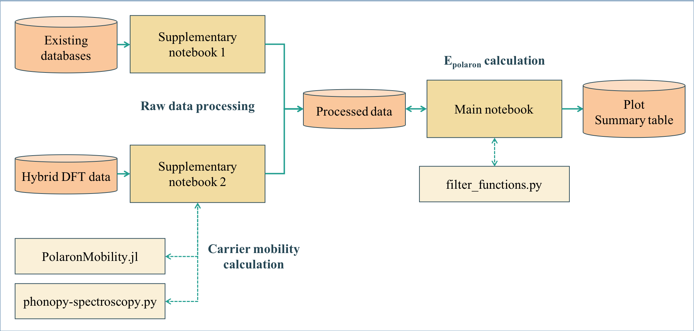

# README
Data repository for the publication *Nature of Electron and Hole Charge Carriers in Metal Oxides* - D. W. Davies et. al.

## Overview

## Inventory
### Notebooks
- **Main\_notebook\_polarons\_data\_2019:** Reproduce results from the publication using only processed data already available in this repository.
- **Supplementary\_notebook\_1\_raw\_data\_extraction:** Produce the processed data in this repository from publicly available datasets.
- **Supplementary\_notebook\_2\_hybrid\_DFT\_data\_processing:** Produce the processed data in this repository from VASP output files.

### Julia scripts
- **characteristic\_phonon\_freq.jl:** Calculate characteristic phonon frequencies from VASP output files.
- **mobility_calculation.jl:** Calculate carrier mobilities.

### Misc
- **matplotlibrc:** Used by matplotlib to make plots look the same (as close as possible) as they are in the publication.
- **filter_functions.py:** Contains additional function used in the main notebook.

## Requirements
### To run just the main notebook:
- Python3
- numpy
- scipy
- pandas
- [smact](http://github.com/wmd-group/smact)

### To run the supplementary notebooks
All of the above, plus:

- [pymatgen](http://pymatgen.org)
- [matminer](https://hackingmaterials.lbl.gov/matminer/)
- [PolaronMobility.jl](https://github.com/jarvist/PolaronMobility.jl) and any dependencies.
- [Phonopy-spectroscopy](https://github.com/JMSkelton/Phonopy-Spectroscopy) and any dependencies (for the vasp-ir script).
- [BoltzTraP](http://www.icams.de/content/research/software-development/boltztrap/)

`pip install numpy scipy pandas pymatgen`

## Data
The data records from the following publications must be downloaded and put into `raw_data/` in order to run the supplementary notebooks:

- [Effective masses](https://www.nature.com/articles/sdata201785): The two files must be extracted into `raw_data/eff_mass_data_1/` and `raw_data/eff_mass_data_2/`
- [Dielectric constants](https://www.nature.com/articles/sdata201865): Must be extracted into `raw_data/dielectric_pettreto/`.

Raw hybrid DFT data is available from [ZENODO LINK] and must be extracted into `raw_data/hybrid_calcs_raw/`.
